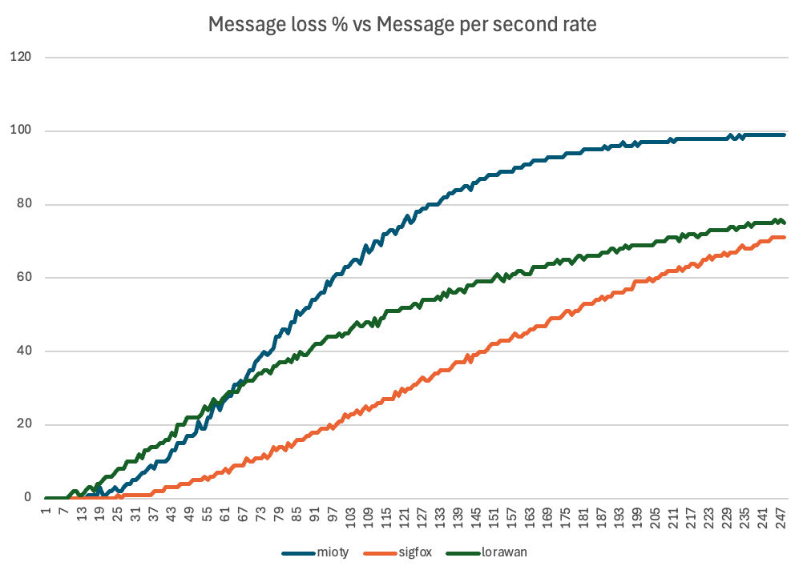

## LPWAN Collision Simulator

### disclaimer

This model has not been validated and I'm currently trying to understand if the 
results are valid or not. I need reviewers to identify what could be wrong in my code.

### What it is simulating?

This is simulating the random emission of LPWAN frames at different rates (message / second) and 
it measures the %age of messages the receiver may be able to decode, it takes into consideration the
repeat or data redundancy to estimate the ability to receive a frame.

Only uplink and single data length is considered.

The purpose is to compare as much as possible apple & apple

### How does it work?

__ModelRunner__ defines a simulation experience:
The simulation is made on a period of time of 20s and a windows of 12 seconds is considered in the middle of
this period. The purpose is to consider a warm system and not a starting system. The collision is calculated only on the 
frames starting and finishing during the 12s windows.

__RadioModel__ defines the protocol rules:
This model defines the different radio emissions (start,stop,frequency...) and link them. It manages the collision rules and
decides if a message is lost or not due to collisions after the experience. Every LPWAN have its own model class.

### Assumptions made
- Sigfox: collision happen as soon as two radio emissions are on same +/- 1 channel and overlap in time.
  - 12 bytes data / 3 transmissions (standard on Sigfox)
- LoRaWan: no collision between SF, 8 channels, given distribution of SF see code
  - 10 bytes of data / NBTrans=3
- Mioty: 2x100Khz mode with high precision TCXO, frame lost when more than 2/3 of split in collision
  - core frame (10bytes) / 3 transmissions ( standard on Mioty )

### Run

Just load into intelliJ and run. It generates console display and csv.

### Current results

Does not consider the following results as a source of trust, the models are not validated and bugs in computation 
are still totally possible. In particular, I'm not confident with the LoRaWan results. Don't hesitate to submit issues 
to share your remark and model improvement.

